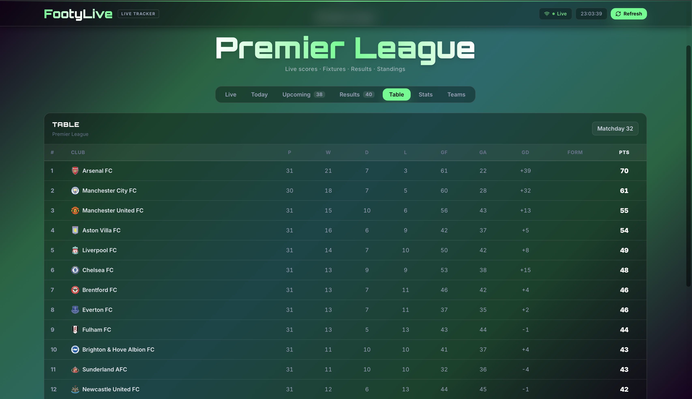

# FootyLive

Real-time football scores, fixtures, standings, and a UCL knockout bracket — for the Premier League, Bundesliga, Ligue 1, Serie A, La Liga, and Champions League.



---

## Features

- **Live scores** — live status, scorelines, and recent match states refresh automatically
- **All major leagues** — PL · BUN · L1 · SA · La Liga · UCL, each with its own color theme
- **UCL knockout bracket** — aggregated two-leg ties with correct winner detection
- **Standings & top scorers** — league table with form guide, goal difference, and scorer stats
- **Club profiles** — squad, coach, venue, recent results, and upcoming fixtures per team
- **Today tab** — all of today's matches with live scores that update in real time and final scores once a game ends
- **Auto-recovery** — a background syncer catches any game that finished while the server was down or no tab was open

---

## Tech Stack

| Layer | Technology |
|---|---|
| Frontend | React 18, TypeScript, Vite, Tailwind CSS |
| Routing | React Router v6 |
| Real-time | WebSockets (native FastAPI) |
| Backend | Python 3.11, FastAPI, Uvicorn |
| Database | SQLite + SQLAlchemy ORM |
| External API | [football-data.org](https://www.football-data.org) (free tier) |
| Caching | Redis (optional, graceful fallback) |
| Deployment | Railway (backend) + Vercel (frontend) |

---

## Architecture

```
browser ──WS──▶ FastAPI /ws ──▶ live_match_broadcaster()
                                  │
                                  ├─ every 30s: GET /matches?status=IN_PLAY,PAUSED
                                  │             (one call covers all leagues)
                                  │
                                  └─ detects finished matches → fetches final score
                                       → syncs to SQLite
                                       → broadcasts to all connected clients

browser ──HTTP▶ FastAPI /api/* ──▶ SQLite (read)
                                   football-data.org (on-demand / fallback)
```

A `today_match_syncer` background task also runs every 5 minutes, re-syncing a yesterday→tomorrow window across all leagues so scores stay correct even if the broadcaster missed a game.

---

## Getting Started

### Prerequisites

- Python 3.11+
- Node.js 18+
- A free API key from [football-data.org](https://www.football-data.org/client/register)

### Backend

```bash
cd backend
python -m venv venv
source venv/bin/activate      # Windows: venv\Scripts\activate
pip install -r requirements.txt

# Create .env from the example file
cp .env.example .env
# then paste in your real football-data.org API key

uvicorn main:app --reload
```

The server seeds today's matches automatically on startup. To load the full season run:

```bash
curl -X POST http://localhost:8000/api/matches/sync
```

### Frontend

```bash
cd frontend
npm install
npm run dev
```

Open [http://localhost:5173](http://localhost:5173).

---

## Deployment

### Backend → Railway / Render / Railway-style host

1. Push repo to GitHub
2. Create a backend service using the `backend/` directory
3. Set environment variables from `backend/.env.example`
4. After first deploy, hit `POST /api/matches/sync` once to seed match data
5. For a real hosted deployment, move from local SQLite to a persistent hosted database

### Frontend → Vercel

1. Import repo on [vercel.com](https://vercel.com) → set root directory to `frontend/`
2. Add environment variables:
   - `VITE_API_ORIGIN` = `https://your-app.railway.app`
   - `VITE_WS_URL` = `wss://your-app.railway.app/ws`
3. Deploy — every push to `main` redeploys automatically

---

## API Reference

| Method | Endpoint | Description |
|---|---|---|
| `GET` | `/api/matches/live` | Live matches by competition |
| `GET` | `/api/matches/today` | Today's matches |
| `GET` | `/api/matches/upcoming` | Upcoming fixtures |
| `GET` | `/api/matches/{id}` | Match detail with events |
| `POST` | `/api/matches/sync` | Sync full season from football-data.org |
| `GET` | `/api/standings` | League table |
| `GET` | `/api/standings/cl-bracket` | UCL knockout bracket |
| `GET` | `/api/scorers` | Top scorers |
| `GET` | `/api/teams` | Teams in a competition |
| `GET` | `/api/teams/{id}/history` | Team results + upcoming fixtures |
| `GET` | `/api/teams/{id}/details` | Squad, coach, venue |
| `WS` | `/ws` | Live score push |

---

## License

MIT
